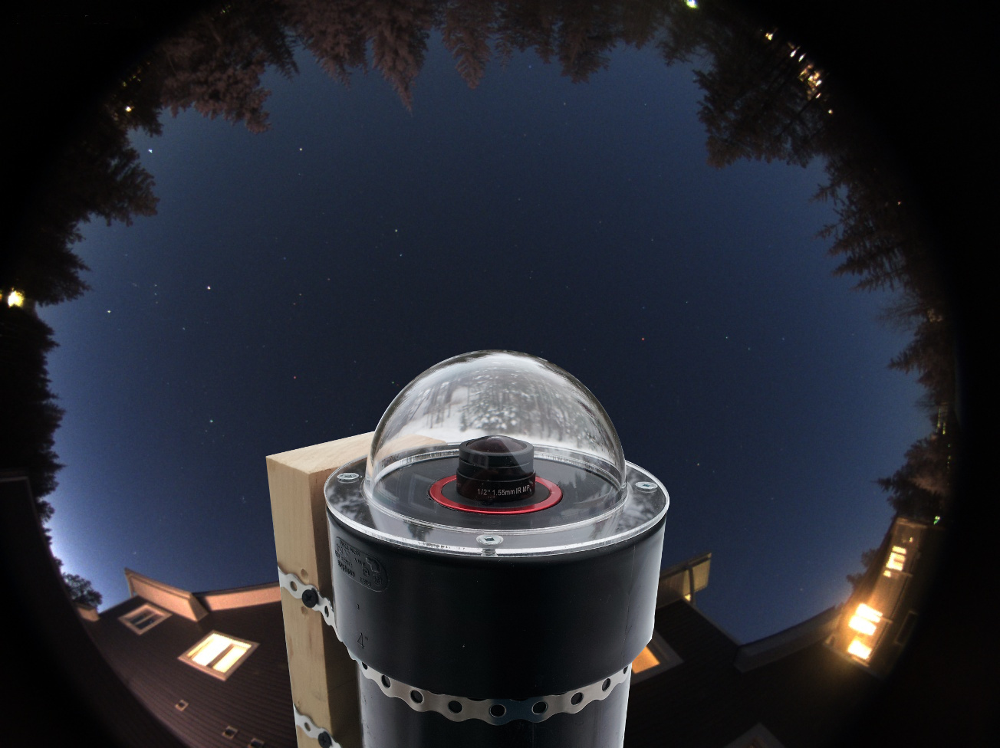
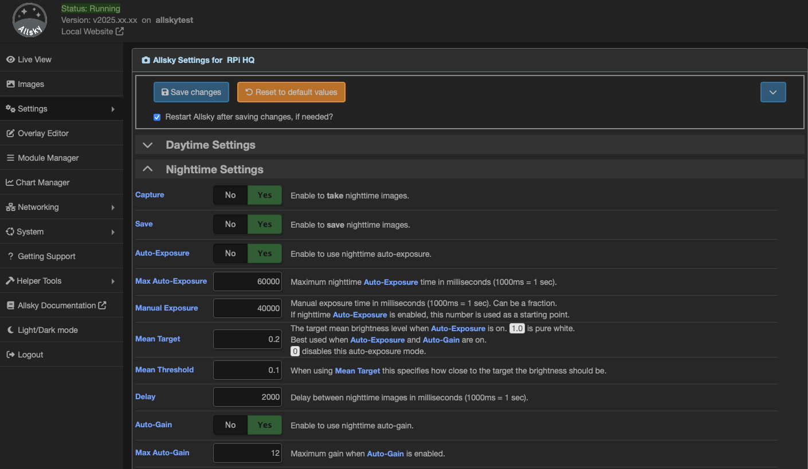
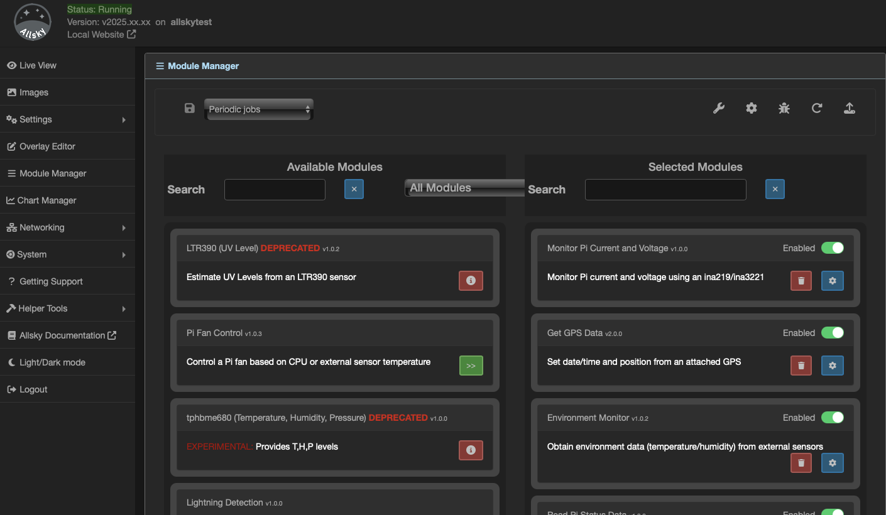
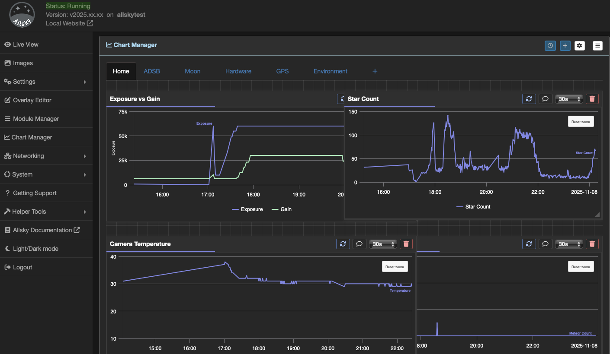
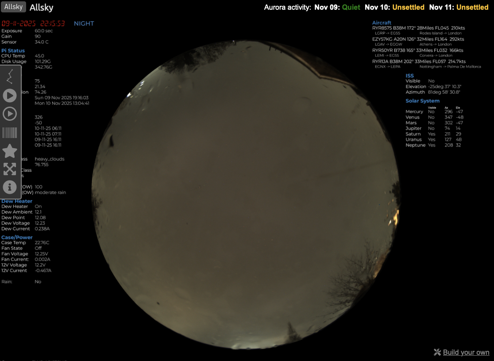
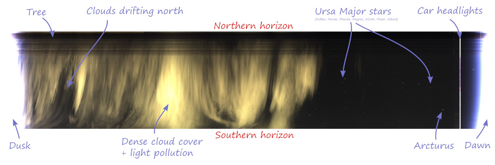
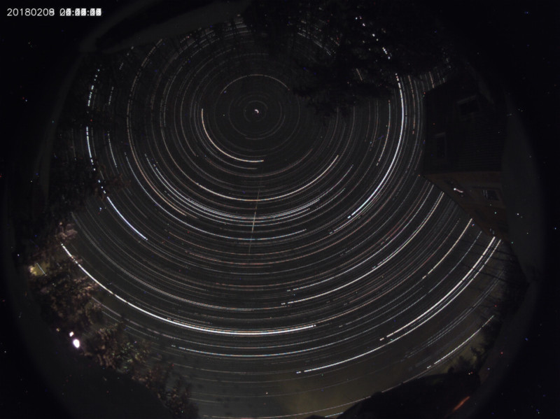
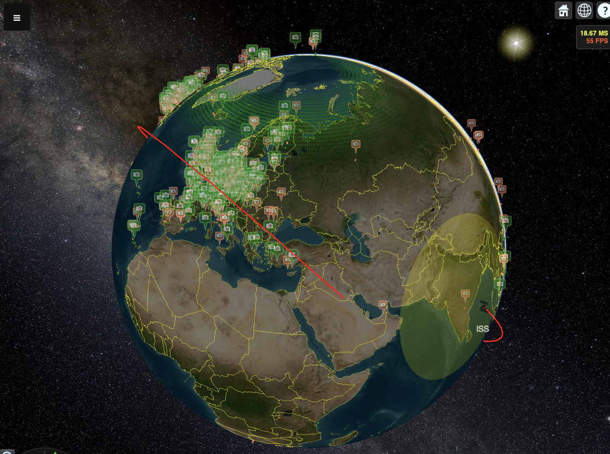

# Allsky Camera  [](https://www.paypal.com/cgi-bin/webscr?cmd=_s-xclick&hosted_button_id=MEBU2KN75G2NG&source=url)




Allsky transforms a camera into a tireless, intelligent observer of the night sky — an automated system that watches, records, and analyses everything that happens above you.

Using a high-sensitivity camera, powerful Raspberry Pi-based software, and modular extensions, Allsky captures meteors, satellites, aurora, and passing cloud, 24 hours a day. Each frame is processed in real time to reveal events invisible to the naked eye — and every night becomes its own story told through data, images, and motion.

But Allsky is more than just a camera — it’s an ecosystem.
The web-based interface lets you monitor your system live, review captured events, design custom overlays, visualise sensor data, and automate your setup with a flexible module system. From temperature and dew heater control to star detection and meteor analytics, every feature works together in a single, polished dashboard.

Built by enthusiasts for enthusiasts, Allsky is open, extensible, and endlessly curious — a fusion of astrophotography, automation, and discovery.


> The Allsky Camera software was originally created by Thomas Jacquin, a developer and astrophotography  enthusiast based in Canada.
>
> Thomas released the first version of Allsky around 2018, designed to run on a Raspberry Pi with a ZWO ASI or Raspberry Pi HQ camera to capture images of the entire sky — automatically creating timelapses, keograms, and detecting meteors.
>
>Since then, the project has grown into a large open-source community effort on GitHub under the Allsky Team organisation, with contributions from many developers and users:
>
>Thomas continues to be recognised as the founder and original author, while the Allsky Team now maintains and evolves the software collaboratively.
>
> The current maintainers are
>  * Eric Claeys - @EricClaeys 
>  * Alex Greenland - @Alex-developer 


### Ready to capture the sky?
Skip the details and **[head straight to the setup guide](#requirements)** to begin installing Allsky.

## Key Features Summary

> <br>
> Below is a list of key features. See later in this document for more details on each.
> <br><br>

* Runs on a variety of Raspberry Pi Single Board Computers (SBCs)
* Web-based User Interface (WebUI)
   * View captured images, timelapses, startrails and keograms
   * Control capture and image-processing settings
   * Manage Allsky services
   * Control the Pi directly
   * Add custom functions via user-defined buttons
   * Get support
   * Access documentation
   * Light / Dark modes
* Remote website / server for storing images
   * Automatically upload capture images, timelapses, startrails and keograms
   * Allows easier sharing of your data with others
* Timelapse creation
* Mini-timelapse
   * Create a mini timelapse from the last X captured images
* Keogram creation
* Keolapse creation
* Keolapse creation
* Startrails creation
* Allsky Map
   * A global map of Allsky cameras
   * Share your camera with others
* Overlay System
   * Design fully custom overlays tailored to your setup
   * Use separate overlays for day and night captures
   * Enjoy an intuitive drag-and-drop interface for effortless layout editing
   * Choose exactly which data fields to display from a rich, dynamic list
   * Group related fields together for easier movement and organization
   * Fine-tune layouts with precise alignment and spacing controls
   * Insert predefined blocks — such as all Sun-related data — with a single click
   * Use any font to style your overlays your way
   * Customize the format of every field for consistent presentation
   * Add your own images, logos, or icons to any overlay for a personal touch
* Module System
   * Modular architecture allowing you to add only the features you need
   * Developers can create new modules using the provided developer documentation
   * Developers can contribute modules to the main Allsky project for the community
   * Multiple “flows” determine when modules run:
      * Daytime Capture – Modules that run during the day
      * Nighttime Capture – Modules that run during the night
      * Day → Night – Modules that run during the day-to-night transition
      * Night → Day – Modules that run during the night-to-day transition
      * Periodic – Modules that run at regular intervals
   * Key Modules (include but not limited to):
      > <br>
      > NOTE: Some modules require external hardware or third-party services.
      > <br><br>
      * Star Count – Counts stars in captured images
      * Meteor Detection – Detects meteors automatically
      * Environment – Captures environmental data using sensors or APIs
      * Dew Heater – Controls an external dew-heater system
      * Hardware Status – Monitors CPU temperature, memory, and disk usage
      * Cloud Detection – Determines sky clarity via sensors or AI methods
      * ADSB – Displays aircraft data from local or online sources
      * Fans – Controls external cooling or ventilation fans
      * Solar System – Calculates data for the Sun, Moon, planets, and satellites
      * Power – Measures power consumption (e.g., dew-heater usage)
      * SQM – Sky Quality Meter reporting Lux and estimated Bortle class
      * GPS – Sets location and time from an external GPS receiver
   * Supported Sensors / 3rd-Party Integrations
      | Integration / Sensor | Description |
      |:----------------------|:-------------|
      | **SHT31** | Temperature Sensor |
      | **SHT4x** | Temperature Sensor |
      | **DHT22** | Temperature Sensor |
      | **DHT11** | Temperature Sensor |
      | **AM2302** | Temperature Sensor |
      | **BME280** | Temperature Sensor |
      | **HTU21** | Temperature Sensor |
      | **AHTx0** | Temperature Sensor |
      | **DS18B20** | Temperature Sensor |
      | **SCD30** | Temperature Sensor |
      | **BME680** | Temperature Sensor |
      | **OpenWeather** | Weather Data Provider |
      | **Ecowitt / Ecowitt Local** | Weather Sensors |
      | **Home Assistant** | External Integration |
      | **S.M.A.R.T** | Hard-disk Monitoring |
      | **INA219** | 1-Channel Power Sensor |
      | **INA3221** | 3-Channel Power Sensor |
      | **TSL2591** | Light Sensor |
      | **TSL2561** | Light Sensor |
      | **LTR390** | Light Sensor |
      | **MLX90640** | Infrared Camera |
      | **PMS5003 / PMS7003 / PMSA003** | Air-Quality Sensors |
      | **AS3935** | Lightning Sensor |
      | **28BYJ-48** | Stepper Motor |
      | **A4988** | Stepper Motor Driver |
      | **Titan Astro** | Allsky Shield Integration |
      | **ADS-B Sources** | Local SDR, OpenSky, AirplanesLive, adsb.fi |
      | **Discord** | Send images to Discord channels |
      | **InfluxDB** | Send data to an InfluxDB instance |
      | **MQTT** | Publish data to an MQTT broker |
      | **Redis** | Send data to a Redis server |
      | **OpenWeather** | Retrieve weather data |
      | **Weather Underground** | Retrieve weather data |
      | **NOAA** | Access space-weather data |

      * *And more…*
      > <br>
      > If you have a sensor that isn’t currently supported, please contact us.
      > <br><br>
   * Charts System
      * Display data from various sources such as:
         * Camera Sensor
         * Environment
         * Dew Heater
         * *And more…*
      * Create your own custom charts


<!-- =============================================================================== --> 
## Requirements

In order to run the Allsky software you need:

 * A Raspberry Pi Zero 2, Pi Zero 2 W, Pi 2, Pi 3, Pi 4, Pi 5, or Le Potato.
 * Raspberry Pi OS Bullseye, Bookworm or Pixie.  Non-Pi OS operating systems like Ubuntu are NOT supported.  If possible use the "Desktop" version of the Pi OS Bookworm 64-bit release.
 * A camera:
    * Any ZWO camera sold before August 21, 2025,
    * or one of the following cameras:
       * Raspberry Pi:
          * HQ (IMX477 sensor)
          * Module 3 (IMX708 sensor)
          * Version 1 (OV5647 sensor; NOT RECOMMENDED: 0.9 second maximum exposure)
       * Arducam:
          * 16 MP (IMX519 sensor)
          * 64 MP (arducam_64mp sensor)
          * 462 (arducam-pivariety sensor)
          * 64 MP Owlsight (OV64a40 sensor)
       * Other:
          * Waveshare imx219-d160 (IMX290 sensor)
          * OneInchEye IMX283 (IMX283 sensor)
          * IMX290 60.00 fps

 
> __NOTES:__
>	- The ZWO ASI120-series cameras are __not__ recommended due to their tendency to produce poor-quality images.
>	- The Pi Zero with its limited memory and _very_ limited CPU power is not recommended.  You probably won't be able to create keograms, startrails, or timelapse videos.
>	- The Pi Zero 2 / Pi Zero 2 W with their limited memory and somewhat limited CPU power is not recommended unless cost is the only concern.  Creating keograms, startrails, and timelapse videos may or may not be possible.
>	- The CM4 and CM5 modules will work if mounted in a duaghter board.
>	- The Le Potato is the only "Pi-compatible" board that we've found to actually be compatible, so buyer beware.


<!-- =============================================================================== --> 
## Software Installation

See the [detailed installation instructions](./html/documentation/installations/Allsky.html).

---

## Web User Interface (WebUI)



The WebUI is used to administer Allsky, and to a lesser extent, your Pi. It can also be used to view the current image as well as all saved images, keograms, startrails, and timelapse videos.

A public page is also available in order to view the current image without having to log into the WebUI and without being able to do any administrative tasks. This can be useful for people who don't use an Allsky Website but still want to share a view of their sky:

```
http://your_raspberry_IP/public.php
```

Make sure this page is publicly viewable.
If it is behind a firewall consult the documentation for your network equipment for information on allowing inbound connections.

> __NOTES:__
>  * If you intend to expose the Pi to the internet then please ensure 
>    - You fully understand the implications of doing this
>    - You are NOT using the default password
>    - You have set a secure password

The WebUI has a link to the Allsky Documentation which describes all the settings Allsky uses as well as troubleshooting information.
It should be used before requesting support on GitHub.

---

## The Overlay Editor


The overlay editor allows you to add custom data to your captured images. This data can include:

   * Plain text fields
      * These can use any font you upload
   * Images
      * You can upload new images for use in your overlays
   * Data from Allsky or its modules
      * Core Allsky generates a large amount of data, which is further extended by additional modules. All of this data is available for display on your overlays
   * Simple graphics to highlight or group related fields

Since you may not want the same data on daytime and nighttime captures — for example, displaying a star count during the day doesn’t make sense — you can create separate overlays for day and night. In fact, you can build a library of overlays and switch between them as needed.

All data captured by Allsky is stored internally in precise formats. The overlay editor allows you to format this data however you wish. For example, if temperature is stored to three decimal places but you only want to show one, simply set the appropriate format in the format editor.

You can upload TrueType or OpenType fonts for use in your overlays.

If you’d like to add images — such as a compass or logo — a core set of images is included, and you can also upload your own.

Several modules require masks, which are applied to images to blank out regions before processing. This is important for tasks like meteor detection, where false positives must be avoided. The overlay editor includes a built-in mask drawing tool so you can create and save masks directly — no need for GIMP or Photoshop anymore.

Aligning fields on the overlay can be tricky, so the editor provides alignment tools to help. Fields can also be grouped, allowing you to move aligned items together as one unit.

Allsky and several modules provide “blocks” of fields. When you add one of these blocks to the overlay, all relevant fields are automatically added. For example, adding the Sun block inserts all sun-related times in one step — a quick way to add multiple fields at once.

There are many more features available so please see the main documentation for full details.

---

## Module Manager



Modules are essentially plugins for Allsky that extend its functionality. The Module Manager allows you to enable, configure, and manage these modules.

The processing engine in Allsky uses what we call **Flows**, or **pipelines**. Modules are executed within these flows during image capture. There are five defined flows:

| Flow | Description |
|:---------|:-------------|
| Daytime | This flow runs after each image is captured during the day |
| Nighttime | This flow runs after each image is captured during the night |
| Day to Night | This flow runs during the transition from daytime to nighttime capture |
| Night to Day | This flow runs during the transition from nighttime to daytime capture |
| Periodic | This flow runs on a periodic timer |

In general, we aim to keep the **image capture flows** as fast as possible to maintain consistent intervals between images. The **Periodic** flow allows modules that take longer to execute to run independently, without affecting the main capture process.

Allsky includes a **core set of modules**, and there is also a collection of **extra modules** that provide additional features. These extra modules are developed both by the Allsky Team and by community contributors.

Many modules communicate with **hardware sensors**, and to assist with this, the Module Manager includes a **Device Manager** that displays all devices currently connected to the Pi.

Contributions to the extra modules are always welcome. Details on how to **develop and contribute modules** can be found in the **Module Developer Documentation**.

For details on available modules and their configuration, please see the **main documentation**.

---

## Chart Manager



Allsky and its associated modules generate a lot of data that can be visualised using the chart manager.

Allsky contains a predefined library of charts and modules can add additional charts to this list.

You can also create custom charts from all of the available data in a variety of formats such as line, bar, gauge and yes/no


---

## Allsky Website



The local Allsky Website (i.e., on the Pi) is installed with Allsky but must be enabled in the WebUI in order to use it.
You can also install the Allsky Website on a remote server so it can be viewable via the Internet.

See [Installation / Upgrading --> Website](https://htmlpreview.github.io/?https://raw.githubusercontent.com/AllskyTeam/allsky/master/html/documentation/installations/AllskyWebsite.html) for information on how to install and configure an Allsky Website.


## Remote server
Allsky images, keograms, startrails, and timelapse videos can optionally be uploaded to a remote server __not__ running an Allsky Website.  This is useful if you have a personal website and want to include the most recent Allsky images.

See [Installation / Upgrading --> Remote server](https://htmlpreview.github.io/?https://raw.githubusercontent.com/AllskyTeam/allsky/master/html/documentation/installations/RemoteServer.html) for information on how to configure a remote server.

---

## Post-capture processing

Captured images can be resized, cropped, and stretched, and bad images (i.e., too light or too dark) can be removed automatically.

Allsky supports running "modules" after each picture is taken to change the image (e.g., add an overlay) or perform other tasks (e.g., count the number of stars in the image).  You can determine what modules to run and in what order.  Modules can pass data to other modules, for example, the Start Count Module can pass the star count to the Overlay Module to be added to the overlay.

The Overlay Editor lets you easily specify what text and images you want in your overlay, and place them using drag-and-drop.  Each field can be formatted however you want (font, color, size, position, rotation, etc.).  The only limit is your imagination!!

See [Explanations / How To -> Overlays](https://htmlpreview.github.io/?https://raw.githubusercontent.com/AllskyTeam/allsky/master/html/documentation/overlays/overlays.html) and [Explanations / How To -> Modules](https://htmlpreview.github.io/?https://raw.githubusercontent.com/AllskyTeam/allsky/master/html/documentation/modules/modules.html) for more information.

---

## Dark frame subtraction

Dark frame subtraction removes white (i.e., "hot") pixels from images by taking images with a cover over the camera lens and subtracting those images from images.

See [Explanations / How To -> Dark frames](https://htmlpreview.github.io/?https://raw.githubusercontent.com/AllskyTeam/allsky/master/html/documentation/explanations/darkFrames.html) for more information.

---

## Timelapse and mini timelapse

By default, a timelapse video is generated at the end of nighttime from all of the images captured in the last 24 hours.

"Mini" timelapse videos can also be created every few images, and contain the last several images.  They are useful to see what the sky was recently like.

See [Explanations / How To --> Timelapses](https://htmlpreview.github.io/?https://raw.githubusercontent.com/AllskyTeam/allsky/master/html/documentation/explanations/timelapses.html).

---

## Keograms



A __Keogram__ is an image giving a quick view of the day's activity.
For each image a central vertical column 1 pixel wide is extracted. All these columns are then stitched together from left to right. This results in a timeline that reads from dawn to the end of nighttime (the image above only shows nighttime data since daytime images were turned off).

See [Explanations / How To --> Keograms](https://htmlpreview.github.io/?https://raw.githubusercontent.com/AllskyTeam/allsky/master/html/documentation/explanations/keograms.html).

---

## Startrails



__Startrails__ are generated by stacking all the images from a night on top of each other.
In the image above, Polaris is centered about one-fourth the way from the top.

See [Explanations / How To --> Startrails](https://htmlpreview.github.io/?https://raw.githubusercontent.com/AllskyTeam/allsky/master/html/documentation/explanations/startrails.html).
	
---


## Automatic deletion of old data

You can specify how many days worth of images to keep in order to keep the Raspberry Pi SD card from filling up.  If you are using the Allsky Website on your Pi, you can specify how many days worth of its imags to keep.


See the __Days to Keep on Pi Website__ and __Web Days To Keep on Remote Website__ settings in [Settings --> Allsky](https://htmlpreview.github.io/?https://raw.githubusercontent.com/AllskyTeam/allsky/master/html/documentation/settings/allsky.html).

---

## Share your sky


If you want your allsky camera added to the [Allsky map](http://www.thomasjacquin.com/allsky-map), see [Put your camera on Allsky Map](https://htmlpreview.github.io/?https://raw.githubusercontent.com/AllskyTeam/allsky/master/html/documentation/miscellaneous/AllskyMap.html).

If you know anyone in Greenland or Antartica, send them a camera!!

<p align="center">
<a href="https://www.thomasjacquin.com/allsky-map/" title="Allsky map example - click to see real map">
</a>
</p>



<center>The new version of the Allsky map which will be released very soon</center>

* Full 3d rotatable, zoomable, pan and tilt globe
* Shows all online an offline cameras
* Shows position and orbit of ISS
* Shows Aurora, both North and South poles

---


## Release changes

See the
[Allsky Version Change Log](https://htmlpreview.github.io/?https://raw.githubusercontent.com/AllskyTeam/allsky/master/html/documentation/changeLog.html)
for a list of changes in this release and all prior releases.

---

 
## Donation
If you found this project useful, here's a link to send Thomas a cup of coffee :)

[](https://www.paypal.com/cgi-bin/webscr?cmd=_s-xclick&hosted_button_id=MEBU2KN75G2NG&source=url)
