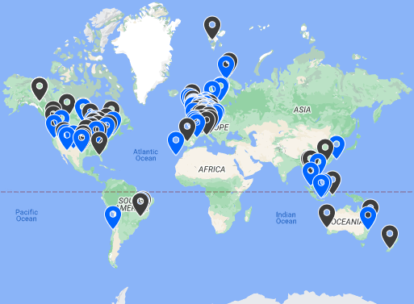

# Allsky Camera  [](https://www.paypal.com/cgi-bin/webscr?cmd=_s-xclick&hosted_button_id=MEBU2KN75G2NG&source=url)

> **This README and the [Allsky documentation](https://github.com/thomasjacquin/allsky/wiki) will help get your allsky camera up and running.**

This is the source code for the Allsky Camera project described [on Instructables](http://www.instructables.com/id/Wireless-All-Sky-Camera/).
&nbsp;  
<p align="center">

</p>


<!-- =============================================================================== --> 
### Requirements
<details><summary>More Details...</summary>

&nbsp;  
You will need the following hardware:

 * A camera (Raspberry Pi HQ or newer, or ZWO ASI)
	- The ZWO ASI120-series cameras are not recommended due to somewhat poor quality.
 * A Raspberry Pi (2, 3, 4 or Zero).
	- The Pi Zero, with its limited memory and CPU power, is not recommended unless cost is a major concern.

**NOTE:** See the "Troubleshooting -> ZWO Cameras" section of the documentation for notes on the ASI120-series and T7 / T7C cameras.

---
</details>


&nbsp;
<!-- =============================================================================== --> 
### Software Installation
<details><summary>More Details...</summary>

&nbsp;  
PatriotAstro created a great [video](https://www.youtube.com/watch?v=7TGpGz5SeVI) describing the installation steps below.
**We highly suggest viewing it before installing the software.**


Installation instructions can be found in the "Installing / Upgrading" pages of the Allsky documentation.

> NOTE: Starting with this release, the WebUI is included in the main Allsky package.

---
</details>


&nbsp;
<!-- =============================================================================== --> 
### Web User Interface (WebUI)
<details><summary>More Details...</summary>

&nbsp;  
<p align="center"></p>

The WebUI is used to administer Allsky, and to a lesser extent, your Pi. It can also be used to view the current image as well as all saved images, keograms, startrails, and timelapse videos.

The WebUI code is based on an older version of [**RaspAP**](https://github.com/billz/raspap-webgui).
	
The WebUI is installed in `~/allsky/html` as part of the installation of Allsky, and:
* Changes your hostname to **allsky** (or whatever you called it during installation).
* Installs the **lighttpd** web server.
* Prompts to remove an old version of the WebUI in `/var/www/html`, if it exists (but keeps any old Allsky Website in `/var/www/html/allsky`).
* Suggests you upgrade the Allsky Website if an old version is found.


A public page is also available in order to view the current image without having to log into the WebUI and without being able to do any administrative tasks. This can be useful for people who don't have a Allsky Website but still want to share a view of their sky:

```
http://your_raspberry_IP/public.php
```

Make sure this page is publically viewable.
If it is behind a firewall consult the documentation for your network equipment for information on allowing inbound connections.


<!-- this is old
A demo of the WebUI is available [**here**](http://thomasjacquin.com/allsky-portal). **Note**: Most of the buttons have been disabled for the demo.
-->
	
---
</details>

&nbsp;
<!-- =============================================================================== --> 
### Allsky Website
<details><summary>More Details...</summary>

&nbsp;  
You can display your files on a website, either on the Pi or on another machine.

See the "Installation / Upgrading" -> Website" page for information on how to install and configure an Allsky Website.

---
</details>


&nbsp;
<!-- =============================================================================== --> 
### Dark frame subtraction
<details><summary>More Details...</summary>

&nbsp;  
Dark frame subtraction removes hot pixels from images. It does this by taking images at different temperatures with a cover on your camera lens and subtracting those images from all images taken throughout the night.

See the "Explanations / How To -> Dark frames" documentation page for more information.

---
</details>


&nbsp;
<!-- =============================================================================== --> 
### Timelapse and mini timelapse
<details><summary>More Details...</summary>

&nbsp;  
By default, a timelapse video is generated at the end of nighttime from all of the images captured in the last 24 hours.

"Mini" timelapse videos can also be created every few images, and contain the last several images (both settings are configurable).  They are useful to see what the sky was recently like.

---
</details>


&nbsp;
<!-- =============================================================================== --> 
### Keograms
<details><summary>More Details...</summary>

&nbsp;  


A **Keogram** is an image giving a quick view of the day's activity.
For each image a central vertical column 1 pixel wide is extracted. All these columns are then stitched together from left to right. This results in a timeline that reads from dawn to the end of nighttime (the image above only shows nighttime data since daytime images were turned off).

See the "Explanations / How To -> Keograms" documentation page for more information.


---
</details>


&nbsp;
<!-- =============================================================================== --> 
### Startrails
<details><summary>More Details...</summary>

&nbsp;  


**Startrails** are generated by stacking all the images from a night on top of each other.

See the "Explanations / How To -> Startrails" documentation page for more information.
	

---
</details>


&nbsp;
<!-- =============================================================================== --> 
### Automatic deletion of old data
<details><summary>More Details...</summary>

&nbsp;  
You can specify how many days worth of images to keep in order to keep the Raspberry Pi SD card from filling up.  If you have the Allsky website installed on your Pi, you can specify how many days worth of its imags to keep.


See the **DAYS_TO_KEEP** and **WEB_DAYS_TO_KEEP** settings in the "Settings / Allsky Website" documentation page for more information.

---
</details>


&nbsp;
<!-- =============================================================================== --> 
### Logging information
<details><summary>More Details...</summary>

&nbsp;  
When using Allsky, information is written to a log file. In case the program stopped, crashed, or behaved in an abnormal way, take a look at:
```
tail /var/log/allsky.log
```
	
There are other temporary log files in `allsky/tmp` that are used for debugging.

---
</details>


&nbsp;
<!-- =============================================================================== --> 
### Information for advanced users
<details><summary>More Details...</summary>

&nbsp;  
Experienced users may want to add some additional processing steps at the end of daytime and/or nighttime.
To do so:

```shell
cd ~/allsky/scripts
mv endOfNight_additionalSteps.repo   endOfNight_additionalSteps.sh
mv endOfDay_additionalSteps.repo     endOfDay_additionalSteps.sh
```
and then add your additional processing steps which will be run at the end of daytime or after the usual end-of-night processing, but before the deletion of any old image files.

After you rename the file(s), you can edit the file via the "Editor" link on the left side of the WebUI page.

---
</details>


&nbsp;
<!-- =============================================================================== --> 
### Share your sky

If you want your allsky camera added to the [Allsky map](http://www.thomasjacquin.com/allsky-map), see [these settings](https://github.com/thomasjacquin/allsky/wiki/allsky-Settings/_edit#map-settings).

<p align="center">
<a href="https://www.thomasjacquin.com/allsky-map/">

</a>
</p>


<!-- =============================================================================== --> 
### Release changes
<details><summary>More Details...</summary>

&nbsp;  
* version **v2023.MM.DD**: 
	* Allsky package:
		* New camera support: All ZWO cameras as of January, 2023.  RPi HQ and Module 3 cameras.
		* "Mini" timelapse videos can be created that contain a user-configurable number of the most recent images.  This allows you to continually see the recent sky conditions.
		* Installation improvements:
			* If there is not enough swap space configured you are prompted to add more.  Doing this decreases the chance of timelapse creation problems.
			* If `allsky/tmp` is not a memory-resident filesystem you are prompted to make it one.  This SIGNIFICANTLY decreases the number of writes to the SD card, prolonging its life.			
			* If a `~/allsky-OLD` directory is found it's assumed to be a prior release of Allsky and you'll be prompted to have its images, darks, and other items moved to the new release.
		* `scripts/check_allsky.sh` was added to perform basic sanity checking of your Allsky installation.  Run it after you're done configuring Allsky.
		* Latitude and longitude can now be specified as either a decimal number (e.g., `-105.21`) or with N, S, E, W (e.g., `105.21W`).
		* Removed settings from `config.sh`:
			* `CAMERA`: To update the camera type, use the new **Camera Type** setting in the WebUI. This is an advanced setting so you need to click the "Show Advanced Options" button to view it.
			* `POST_END_OF_NIGHT_DATA` is no longer needed since Allsky automatically determines if you have a local Allsky Website, a remote one, or both.
		* New ftp-settings.sh variables:
			* `REMOTE_PORT`: specifies a non-default FTP port.
			* `SSH_KEY_FILE`: path to a SSH private key. When `scp` is used for uploads, this identify file will be used to establish the secure connection.
			* The Secure CP (`scp`) and Google Cloud Service (`gcs`) protocols are now supported for file uploads.
		* Sanity checking is done on many settings.  For example, URLs in Allsky Map data must be reachable from the Internet, and crop areas must fit within the image.
		* The Wiki now points to files in the GitHub `documentation` directory.  A copy of that directory is also on the Pi and accessible via the Documentation link in the WebUI.
		* AUTO_STRETCH now works, and is documented with sample images.
		* Images can now be uploaded using the full `image-YYYYMMDDHHMMSS.jpg` name instead of the shorter `image.jpg` name.  See the `IMG_UPLOAD_ORIGINAL_NAME` Allsky setting in the documentation.
		* Several additional troubleshooting files are written to ~/allsky/tmp.  You shouldn't need to look at them unless there's a problem.
		* An `endOfDay_additionalSteps.sh` script can now be run after the transition from daytime to nighttime.  This can be used, for example, to create a timelapse of daytime images.
		* Many minor enhancements and bug fixes were made.

	* WebUI:
		* The WebUI is now installed in `~/allsky/html`as part of the Allsky installation. The [allsky-portal](https://github.com/thomasjacquin/allsky-portal) repository will be removed as it is outdated and no longer needed.
		* New links on the left side:
			* **Overlay Editor** allows you to drag and drop what text and images you want overlayed on the images.  This is a **significant** improvement over the old mechanism and lets you vary the font size, color, rotation, etc. for everything you add.  You can use variables in the text which get replaced at run-time, e.g., the time.
			* **Module Editor** allows you to specify what actions should take place after an image has been saved, for example, add an overlay or count the number of stars.  Users can add (and hopefully share) their own modules.
			* **Allsky Documentation** accesses the documentation on your Pi.
		* Minimum, maximum, and default values are now correct for all camera models.
		* Fields with missing data are shown in red with a message saying the data is missing.  For example, **Latitude** is a required field.
		* New settings on the **Allsky Settings** page:
			* **Camera Type** is either ZWO or RPi.  This replaces the `CAMERA` variable in the `config.sh` file.
			* **Max Auto-Exposure** for day and night.  When using auto-exposure, exposure times will not exceed this value.
			* **Max Auto-Gain** for day and night.  When using auto-gain, gain values will not exceed this value.
			* **Auto White Balance**, **Red Balance**, and **Blue Balance** are now available for day and night.
			* **Frames to Skip** for day and night determine how many initial auto-exposure frames to ignore when starting Allsky, while the auto-exposure algorithm homes in on the correct exposure.  These frames are often over or under exposed so not worth saving anyhow.
			* **Consistent Delays** determines whether or not the time between the start of exposures will be consistent (current behavior) or not.  When enabled, the time between images is the maximum exposure time plus the delay you set.
			* **Overlay Method** determines if the text overlay (exposure, time, etc.) should be done in the legacy capture program or by an external module that has **significanly** more capabilities (see below).  **NOTE**: the default will change to the external module in a future release, and after that the legacy overlay method will be removed.
			* **Cooling** and **Target Temp.** (ZWO only) now have separate settings for day and night.
			* **Aggression** (ZWO only) determines how much of a calculated exposure change should be applied.  This helps smooth out brightness changes, for example, when a car's headlights appear in one frame.
			* **Gamma** (ZWO only) changes the contrast of an image.  It is only supported by a few cameras; for those that don't, the `AUTO_STRETCH` setting can produce a similar effect.
			* **Offset** (ZWO only) adds about 1/10th the specified amount to each pixel's brightness, thereby brightening the whole image.  Setting this too high causes the image to turn gray.
			* **Contrast** and **Sharpness** (RPi only).
			* **Mean Target** (RPi only) for day and night.  This specifies the mean target brightness (0.0 (pure black) to 1.0 (pure white)) when in auto-exposure mode and works best if auto-gain is also enabled.
			* **Mean Threshold** (RPi only).  This specifies how close the actual mean brightness must be to the **Mean Target**.  For example, if **Mean Target** is 0.5 and **Mean Threshold** is 0.1, the actual mean can vary between 0.4 and 0.6 (0.5 +/- 0.1).			
			* The **Focus Metric** setting is now available for ZWO cameras.  Higher numbers indicate better focus.  Use only when conditions are NOT changing.
			* **Require WebUI Login** specifies whether or not the WebUI should require you to login.  Only set this to "No" if your Pi is on a local network and you trust everyone on the network.  **Do NOT disable it if your Pi is accessible via the Internet!**
		* **NOTE**: the following settings moved from config.sh to the WebUI, and are "advanced" options so you'll need to click the "Show Advanced Options" button to see them:
			* "DAYTIME_CAPTURE" from config.sh is now **Take Daytime Images** in the WebUI.
			* "DAYTIME_SAVE" is **Save Daytime Images**.
			* "DARK_CAPTURE" is **Take Dark Frames**.
			* 'DARK_FRAME_SUBTRACTION" is **Use Dark Frames**.
		* **Debug Level** is more consistent:
			* 0: errors only.
			* 1: level 0 plus warnings and messages about taking and saving pictures.  This is the default.
			* 2: level 1 plus details on images captured, sleep messages and the like.
			* 3: level 2 plus time to save image, details on exposure settings and capture retries.
			* 4: lots of gory details for developers only.
		* Some error messages that appear in the `/var/log/allsky.log` file also appear in the WebUI so you don't miss them.
		* Buttons in the "Dark" mode are now darker.
		* The Allsky and Allsky Website versions are displayed at the top of the page.
		* Many minor enhancements were made.

	* Allsky Website:
		* The Allsky Website is now installed in `~/allsky/html/allsky`.
		* If an older version of the Website is found during Website installation you'll be prompted to have its images and settings moved to the new location.
		* The home page can be customized:
			* You can specify the order, contents, look, and style of the icons on the left side.  You can also hide an icon or display a new one.
			* You can specify the order, contents, and style of the popout that appears on the right side.  For example, you can add a link to pictures of your allsky camera.
			* You can set a background image.
			* You can easily change the maximum width of the image.
			* You can add a link to a personal website.  This link appears at the top of the page.
			* You can add a border around the image to have it stand out on the page.
			* You can hide the "Make Your Own" link on the bottom right of the page.
			* You can change the icon that appears on the browser's tab.
			* See the Allsky Website documentation for other customizations you can make.
		* Left sidebar:
			* The constellation overlay icon (Casseopeia icon) is hidden by default and should only be displayed after you've set the overlay to match your stars.
			* If you are creating mini-timelapse videos, when you install the Website an icon for the current video will appear on the left side.  You can also manually show/hide the icon.
			* There's a new icon to display the image full-size.
			* The startrails and information icons were updated.
		* Popout on right side:
			* A link to your **Image Settings** can optionally be displayed via the **Display Settings** option in the WebUI.
			* The version of Allsky and the Allsky Website are displayed.
		* Configuration file changes:
			* The two prior configuration files (`config.js` and `virtualsky.json`) are replaced by `configuration.json`.
			* There are several new settings, including the ability to specify the opacity of the overlay.		
			* The `overlaySize` setting, which defined both the width and the height of the constellation overlay, was split into `overlayWidth` and `overlayHeight`.  Having separate values can be helpful when trying to get the overlay to line up with the actual stars.
			* The WebUI **Editor** page must be used to edit the Allsky Website's configuration file since it performs various checks before updating the configuration.
			* The **Editor** page should also be used to edit a REMOTE Allsky Website's configuration file for the same reason.  A master copy of the remote server's `configuration.json` is kept on the Pi and automatically re-uploaded to the server after every change..  After you do this, the drop-down list on the **Editor** page will now have `configuration.json (remote Allsky Website)` to distinguish it from a local Website's file.  See the Allsky Website Installation documentation for details.
		* Timelapse video thumbnails are now created by default on the Pi and uploaded to a remote server.  This resolves issues with remote servers that don't support creating thumbnails.  See the `TIMELAPSE_UPLOAD_THUMBNAIL` setting.
		* Resizing the home page with the constellation overlay showing works better (but still needs work).


* version **v2022.03.01**:
	* Switched to date-based release names.
	* Added ability to have your allsky camera added to the [Allsky map](http://www.thomasjacquin.com/allsky-map) by configuring [these settings](https://github.com/thomasjacquin/allsky/wiki/allsky-Settings/_edit#map-settings).  Added `Allsky Map Setup` section to the WebUI to configure the map settings.  The "Lens" field now shows in the popout on the Allsky website (if installed).
	* Significantly enhanced Wiki - more pages and more information on existing pages.  All known issues are described there as well as fixes / workarounds.
	* Added an option to keograms to make them full width, even if few images were used in creating the keogram.  In config.sh, set `KEOGRAM_EXTRA_PARAMETERS="--image-expand"`.
	* Added/changed/deleted settings (in config/config.sh unless otherwise noted):
	  * Added `WEBUI_DATA_FILES`: contains the name of one or more files that contain information to be added to the WebUI's "System" page.  See [this Wiki page](https://github.com/thomasjacquin/allsky/wiki/WEBUI_DATA_FILES) for more information.
	  * Renamed `NIGHTS_TO_KEEP` to `DAYS_TO_KEEP` since it determines how many days of data to keep, not just nighttime data.  If blank (""), ALL days' data are kept.
	  * Deleted `AUTO_DELETE`: its functionality is now in `DAYS_TO_KEEP`.  `DAYS_TO_KEEP=""` is similar to the old `AUTO_DELETE=false`.
	  * Added `WEB_DAYS_TO_KEEP`: specifies how many days of Allsky website images and videos to keep, if the website is installed on your Pi.
	  * Added `WEB_IMAGE_DIR` in config/ftp-settings.sh to allow the images to be copied to a location on your Pi (usually the Allsky website) as well as being copied to a remote machine.  This functionality already existed with timelapse, startrails, and keogram files.
	* The RPi camera now supports all the text overlay features as the ZWO camera, including the "Extra Text" file.
	* Removed the harmless `deprecated pixel format used` message from the timelapse log file.  That message only confused people.
	* Improved the auto-exposure for RPi cameras.
	* Made numerous changes to the ZWO and RPi camera's code that will make it easier to maintain and add new features in the future.
	* If Allsky is stopped or restarted while a file is being uploaded to a remote server, the upload continues, eliminating cases where a temporary file would be left on the server.
	* Decreased other cases where temporary files would be left on remote servers during uploads.  Also, uploads now perform additional error checking to help in debugging.
	* Only one upload can now be done at a time.  Any additional uploads display a message in the log file and then exit. This should eliminate (or signifiantly decrease) cases where a file is overwritten or not found, resulting in an error message or a temporary file left on the server.
	* Added a `--debug` option to `allsky/scripts/upload.sh` to aid in debugging uploads.
	* Upload log files are only created if there was an error; this saves writes to SD cards.
	* The `removeBadImages.sh` script also only creates a log file if there was an error, which saves one write to the SD card _for every image_.
	* Allsky now stops with an error message on unrecoverable errors (e.g., no camera found).  It used to keep restarting and failing forever.
	* More meaningful messages are displayed as images.  For example, in most cases `ERROR.  See /var/log/allsky.log` messages have been replaced with messages containing additional information, for example, `*** ERROR ***  Allsky Stopped!  ZWO camera not found!`.
	* If Allsky is restarted, a new "Allsky software is restarting" message is displayed, instead of a "stopping" followed by "starting" message.
	* The timelapse debug output no longer includes one line for each of several thousand images proced.  This make it easier to see any actual errors.
	* The "Camera Settings" page of the WebUI now displays the minimum, maximum, and default values in a popup for numerical fields.
	* Startrails and Keogram creation no longer crash if invalid files are found.
	* Removed the `allsky/scripts/filename.sh` file.
	* The RPi `Gamma` value in the WebUI was renamed to `Saturation`, which is what it always adjusted; `Gamma` was incorrect.
	* Known issues:
	  * The startrails and keogram programs don't work well if you bin differently during the day and night.  If you don't save daytime images this won't be a problem.
	  * The minimum, maximum, and default values in the "Camera Settings" page of the WebUI, especially for the RPi camera, aren't always correct.  This is especially try if running on the Bullseye operating system, where many of the settings changed.

* version **0.8.3**:
	* Works on Bullseye operating system.
	* RPi version:
	  * Has an improved auto-exposure algorithm.  To use it, set `CAPTURE_EXTRA_PARAMETERS="-daymean 0.5 -nightmean 0.2"` in config.sh (a future version will allow this to be set via the WebUI).
	  * Has many new settings including support for most of the text overlay features that are supported by the ZWO version.  The "extra text" feature will be supported in a future version.
	* New and changed config.sh variables, see the [Software Settings](https://github.com/thomasjacquin/allsky/wiki/allsky-Settings) Wiki page for more information:
	  * `IMG_UPLOAD_FREQUENCY`: how often the image should be uploaded to a website.  Useful with slow uplinks or metered Internet connections.
	  * `IMG_CREATE_THUMBNAILS`: specifies whether or not thumbnails should be created for each image.
	  * `REMOVE_BAD_IMAGES` now defaults to "true" since bad-image detection is now done after a picture is saved rather than once for all pictures at the end of the night.  This helps decrease problems when creating startrails, keograms, and timelapse videos.
	  * `IMG_PREFIX`: no longer used - the name of the image used by the websites is now whatever you specify in the WebUI (default: image.jpg).
	  * **NOTE**: When upgrading to 0.8.3 you MUST follow the steps listed [here](https://github.com/thomasjacquin/allsky/wiki/Upgrade-from-0.8.2-or-prior-versions).
	* Replaced `saveImageDay.sh` and `saveImageNight.sh` with `saveImage.sh` that has improved functionality, including passing the sensor temperature to the dark subtraction commands, thereby eliminating the need for the "temperature.txt" file.
	* The image used by the websites (default: image.jpg) as well as all temporary files are now written to `allsky/tmp`.  **NOTE**: if you are using the Allsky Website you will need to change the "imageName" variable in `/var/www/html/allsky/config.js` to `"/current/tmp/image.jpg"`.
	* You can **significanly** reduce wear on your SD card by making `allsky/tmp` a [memory-based filesystem](https://github.com/thomasjacquin/allsky/wiki/Miscellaneous-Tips).

* version **0.8.1**:
	* Rearranged the directory structure.
	* Created a Wiki with additional documentation and troubleshooting tips.
	* Renamed several variables in `config.sh` and `ftp-settings.sh`.
	* CAMERA type of "auto" is no longer supported - you must specify "ZWO" or "RPi".
	* Startrails and keograms are now created using all CPUs on the Pi, drastically speeding up creation time.
	* Installing the WebUI now preserves any website files (keograms, startrails, etc.) you have.  This allows for non-destructive updates of the WebUI.
	* New script called `upload.sh` centralizes all the upload code from other scripts, and can be used to debug uploading issues.  See [this Wiki page](https://github.com/thomasjacquin/allsky/wiki/Troubleshooting:-uploads) for more information.
	* The RPi camera does much better auto-exposure if you set the `-mode-mean` and `-autoexposure` options.
	* The WebUI will now show the Pi's throttle and low-voltage states, which is useful for debugging.
	* Darks work better.
	* Many bug fixes, error checks, and warnings added.

* version **0.8**:
	* Workaround for ZWO daytime autoexposure bug.
	* Improved exposure transitions between day and night so there's not such a huge change in brightness.
	* Decrease in ZWO sensor temperature.
	* Lots of new settings, including splitting some settings into day and night versions.
	* Error checking and associated log messages added in many places to aid in debugging.
	* Ability to have "notification" images displayed, such as "Allsky is starting up" and "Taking dark frames".
	* Ability to resize uploaded images.
	* Ability to set thumbnail size.
	* Ability to delete bad images (corrupt and too light/dark).
	* Ability to set an image file name prefix.
	* Ability to reset USB bus if ZWO camera isn't found (requires "uhubctl" command to be installed).
	* Ability to specify the format of the time displayed on images.
	* Ability to have the temperature displayed in Celcius, Fahrenheit, or both.
	* Ability to set bitrate on timelapse video.

<!--
* version **0.7**:
	* Added Raspberry Pi camera HQ support (Based on Rob Musquetier's fork)
	* Support for x86 architecture (Ubuntu, etc)
	* Temperature dependant dark frame library
	* Browser based script editor
	* Configuration variables to crop black area around image
	* Timelapse frame rate setting
	* Changed font size default value
* version **0.6**: Added daytime exposure and auto-exposure capability
	* Added -maxexposure, -autoexposure, -maxgain, -autogain options. Note that using autoexposure and autogain at the same time may produce unexpected results (black frames).
	* Autostart is now based on systemd and should work on all raspbian based systems, including headless distributions. Remote controlling will not start multiple instances of the software.
	* Replaced `nodisplay` option with `preview` argument. No preview in autostart mode.
	* When using the WebUI, camera options can be saved without rebooting the RPi.
	* Added a publicly accessible preview to the WebUI: public.php
	* Changed exposure unit to milliseconds instead of microseconds
* version **0.5**: Added Startrails (image stacking) with brightness control
	* Keograms and Startrails generation is now much faster thanks to a rewrite by Jarno Paananen.
* version **0.4**: Added Keograms (summary of the night in one image)
* version **0.3**: Added dark frame subtraction
* version **0.2**: Separated camera settings from code logic
* version **0.1**: Initial release
-->
---
</details>

&nbsp;
<!-- =============================================================================== --> 
### Donation
If you found this project useful, here's a link to send Thomas a cup of coffee :)

[](https://www.paypal.com/cgi-bin/webscr?cmd=_s-xclick&hosted_button_id=MEBU2KN75G2NG&source=url)
