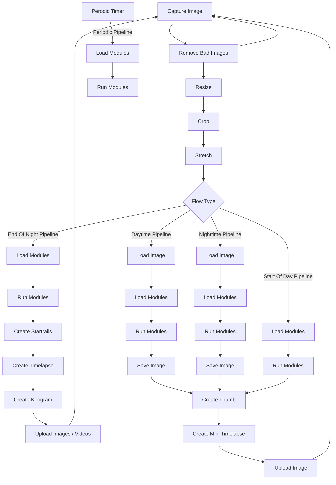

Modules can be used to enhance images created by Allsky. Different modules perform different tasks, the Module Manager allows you to control which modules run and when.

There are two types of modules:

  - Allsky Modules are developed and maintained by the Allsky team and are installed with Allsky.

  - User Modules are developed and maintained by other people and can optionally be installed and deleted if no longer required.

!!! warning  "Warning"

    User Modules should only be installed from the official user-modules   repository using the directions listed there. Installing from other source can be dangerous.

Warning:

Some modules are shown as experimental. Before using these modules you should ensure that you are proficient in analysing Linux log files. Experimental modules can be unstable and as such may "break" Allsky.

Some modules are designed to operate with external hardware, typically connected to the Pi's GPIO pins. Before attempting to use any of these modules make sure you have an understanding of interfacing hardware to the PI's GPIO.

Don't be discouraged by the above warnings - the module system is very flexible and allows you to customise Allsky without having to change any Allsky code.

## What Are Modules

Modules are Python components that extend the functionality of Allsky. They typically fall into one of several categories:

  - **Data-enhancement modules** — These add extra information that can be used in overlays. For example, the Solar System module provides details about celestial objects such as the Moon’s position.
  - **Hardware-control modules** — These interact with external devices. A common example is the Dew Heater module, which reads sensor data and automatically adjusts the dew heater.
  - **Image-processing modules** — These operate on the captured images. Some modify the image itself (such as the Mask module), while others analyse the image to generate additional overlay data, such as the Star Count module.

## Available Pipelines (flows)
There are 5 pipelines available in Allsky.

| Pipeline | Description |
|-----|------|
| Daytime    | Used whilst Allsky is capturing images during the day      |
| Nightime    | Used whilst Allsky is capturing images during the night      |
| Day to Night    | Used when Allsky transitions from Daytime to Nighttime capture     |
| Night to Day    | Used when Allsky transitions from Nighttime  to Daytime capture      |
| Periodic    | Run periodically outside of the main Allsky capture process     |

Each pipeline can run a series of modules in sequence. By default, the Daytime and Nighttime pipelines include the core modules that load and save the captured image; these core modules cannot be removed. All other pipelines start empty. You can use the Module Manager to add additional modules to any pipeline as needed.

## The Module Manager
Pipelines are managed by adding and removing modules via the Module Manager.

!!! info  "Default Pipline"

    When entering the module manager the default pipeline will be either Day or Night depending upon the time of day

/// caption
The Module Manager
///

| Number { .w-5p }| Function { .w-25p } | Description |
|--------|----------|-------------|
| 1 | Save The Current Pipeline | USe this button to save the pipeline after you have made any changes to modules or module configuration. |
| 2 | Select Pipeline| Selects the pipeline to manage |
| 3 | Periodic Flow | Shortcut to display the periodic flow. |
| 4 | Module Filter | Filters modules in the available lkist by module type |
| 5 | Search | Allows searching in the available and selected module lists.
| 6 | Device Manager | Displays the 'Device Manager'.|
| 7 | Settings | Displays the module manager settings |
| 8 | Debug | Displays debug information for the last pipeline run |
| 9 | Available Modules | Lists the modules available to be added to the pipeline |
| 10 | Selected Modules | Lists the modules selected for the  pipeline |

### Enabling a module
To enable a module drag it from the Available Modules column to the Selected Modules column and select the "Enabled" checkbox. The module will become active after the flow has been saved. You can set modules to be automatically enabled when dragging them to the Selected Modules column in the Module Editor Module Options.

Most modules require some configuration after they have been moved to the Selected Modules column. Clicking the settings button will display any configuration options for the module.

### Disabling a Module
There are two ways to disable a module:

  - Drag the module to the Available Modules column - this will disable the module and lose any settings for it.
  - Uncheck the "Enabled" checkbox - this will disable the module but retain any settings. This is the preferred method if you just wish to temporarily disable a module.

### Execution order
The modules are run in the order they appear in the Selected Modules column. To change the order simply drag the modules up or down the list. Modules highlighted in red can not be moved.

!!! info  "Module Order"

    The order modules run is important. For example dont put the overlay module before a module that generates data for it. If you do this the overlay will display the data from the previous run of the pipeline

## Module Settings
Each module provides a dialog where its settings can be managed. These settings are divided into tabs. Each module will have different tabs but there are a few that are consistent across all modules

### The History Tab
If the module produces any graphs then the main graph will be displayed in the history tab

 

/// caption
The History tab
///

### The Variables Tab
This tab shows what variables the module will generate, these can then be used in the VAriable manager to add fields to the overlays. This is really only for information purposes.

 

/// caption
The Variables tab
///

### The Changelog Tab
This tab shows a history of the changes that have been mad to the module

 

/// caption
The Change Log tab
///

### The 'Important' tab
If this module or any portions of it are deprecated then this tab will display information about those deprecations

 

/// caption
The Deprecation tab
///

## Testing Modules
Some modules provide the ability to test the module rather than waiting for it to run and reviewing the Allsky logs. 

 

/// caption
The Test button
///

clicking the test button will run the module with the current settings you have configured and display a results dialog with two tabs

|  |  |
|-------------------------------------------------------|-------------------------------------------------|
| Teh test results | The Extra Data the test generated |

